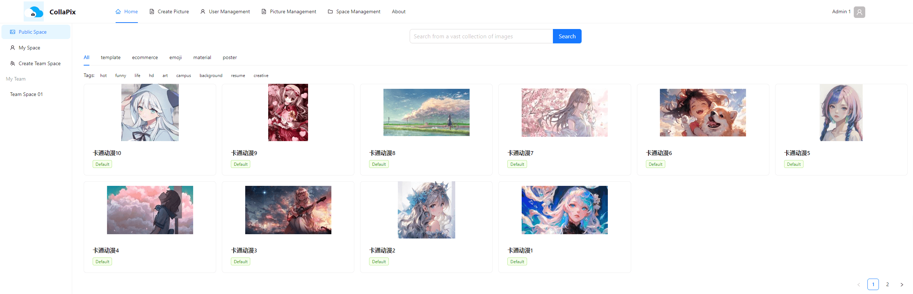
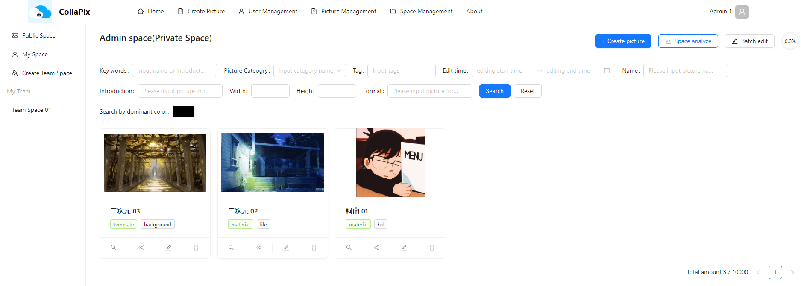
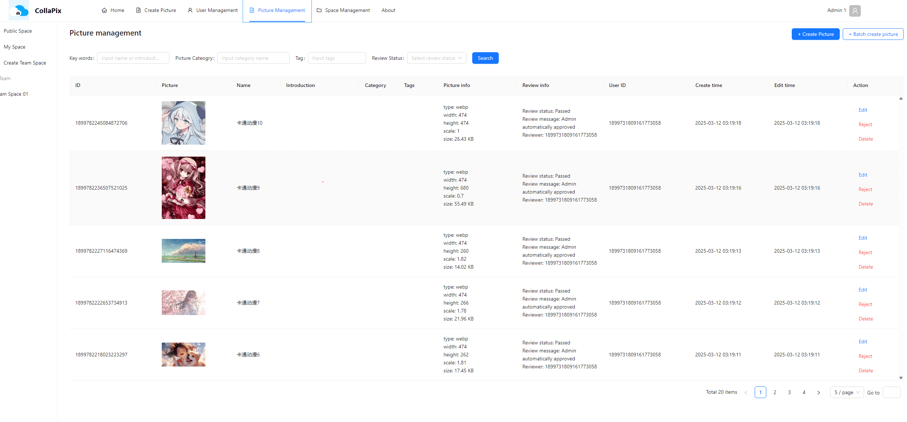
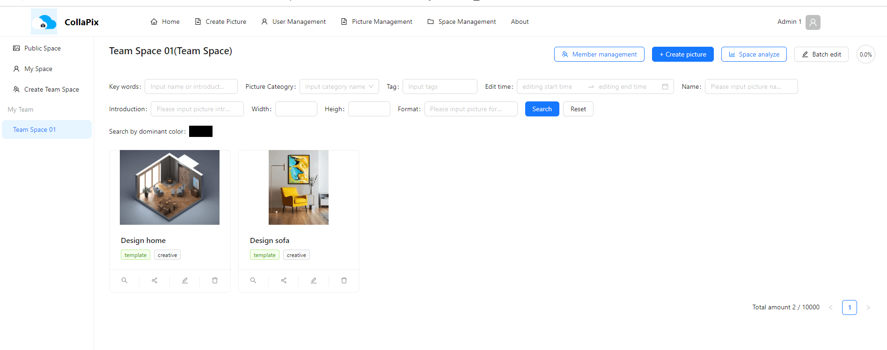

# CollaPix-app

## Introduction
CollaPix is a web application that allows users to create and share pictures. It is built using Vue3 + Vite + TypeScript + AntDesign. The backend server repo is [here](https://github.com/1347428036/CollaPix_DDD).

## Features
### Home page

### My space page

### Picture management page

### Team space page


## Recommended IDE Setup

[VSCode](https://code.visualstudio.com/) +
[Volar](https://marketplace.visualstudio.com/items?itemName=Vue.volar) (and disable Vetur).

## Customize configuration

See [Vite Configuration Reference](https://vite.dev/config/).

## Project Setup

```sh
npm install
```

### Compile and Hot-Reload for Development

```sh
npm run dev
```

### Type-Check, Compile and Minify for Production

```sh
npm run build
```

### Lint with [ESLint](https://eslint.org/)

```sh
npm run lint
```

### Generate API code from OpenAPI specification

```sh
openapi-generator-cli generate --skip-validate-spec -i http://localhost:8123/api/v3/api-docs/CollaPix -g typescript-axios -o ./generated
```
